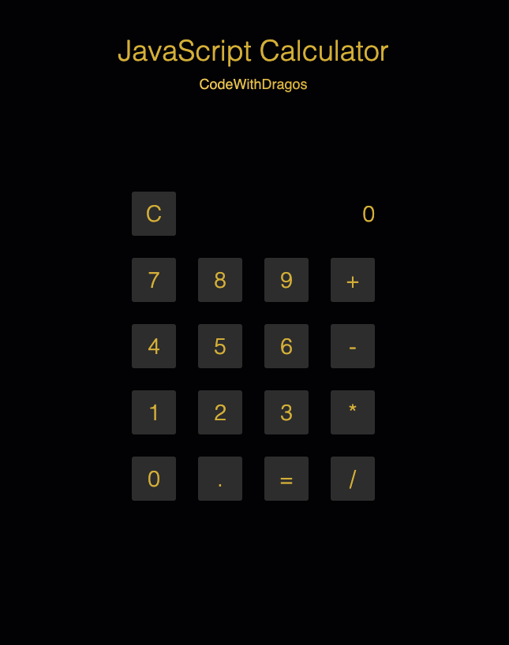

[](https://classroom.github.com/online_ide?assignment_repo_id=3727516&assignment_repo_type=AssignmentRepo)
# Mastery Project: The Calculator

### Getting Started :rocket:

Use your recently learned skills to fix the calculator

### Aceptance Criteria

```
As a user I want to be able to use the calculator for simple operations.
```

### TODO

1. Go to the [index.js](/index.js) file
2. Follow the instructions in the TODO's

## What it should look like



[Live Demo](https://priceless-bell-8654de.netlify.app/).

## Final words

Use meaningful commit names and save your work regularly.

Try to deploy the app to Netlify.

---

### Made with :orange_heart: in Berlin by @CodeWithDragos

© 2019 - 2020 CodeWithDragos. All Rights Reserved.
